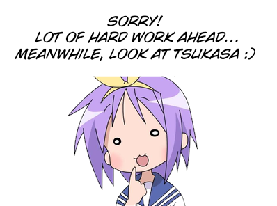

## THIS REPO MAY NOT BE UPDATED IN SOME TIME, I'M CURRENTLY BUSY WITH MY OWN TRANSLATIONS SO I'LL UPDATE THIS FROM TIME TO TIME!
 If you stumble upon an issue, DM me on Discord @guiroshix or join the [Ryouou Gakuen Research Club](https://discord.gg/G2vY4ysCFu)

# Ryouou Gakuen Toolkit Portable W.I.P

  

An accessible version of [RyououGakuenToolkit](https://github.com/TimepieceMaster/RyououGakuenToolkit).

The original project and its core codebase were created by TimepieceMaster. This fork adapts the toolkit to support additional platforms.

This toolkit is designed to modify the game, but its primary purpose is TRANSLATING it into other languages.

Compatible with Linux, Windows and Android.

It also includes a portable patcher powered by GitHub Actions that automatically handles the required assets, so no local installation or asset management is needed.

## Features

- Extract tools
- Patching tools
- Font tools

## Getting Started

Select your platform:

- [Linux](https://github.com/guiroshix/RyououGakuenToolkitPortable/wiki/Troubleshooting)
- [Windows](https://github.com/guiroshix/RyououGakuenToolkitPortable/wiki/Troubleshooting)
- [Android](https://github.com/guiroshix/RyououGakuenToolkitPortable/wiki/Troubleshooting)

## Patching tool

### RGT_RGO_Patch_Builder

[Patching Guide](https://github.com/guiroshix/RyououGakuenToolkitPortable/wiki/Troubleshooting)

### RGOFontGenerator

Pretty useful and necessary if you will mess with translations to non-English

[Font Guide](https://github.com/guiroshix/RyououGakuenToolkitPortable/wiki/Troubleshooting)

## Contribute

Pull requests and suggestions are fine, just keep in mind I made this project to help people who had the same issues that I had.

## License

GPL-3.0

# AI Assistance
This project was developed with the assistance of AI tools for code suggestions, debugging and to speed up some tasks that require a lot of time.

AI assistance was particularly valuable due to my limited experience with the C programming language and the GitHub platform.

All architectural decisions, testing, integration, and final validation were performed manually. AI-generated code was reviewed, adapted, and modified as needed before being incorporated into the project.
